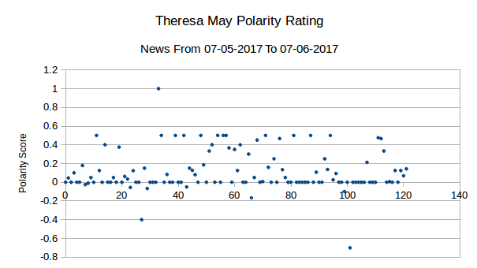
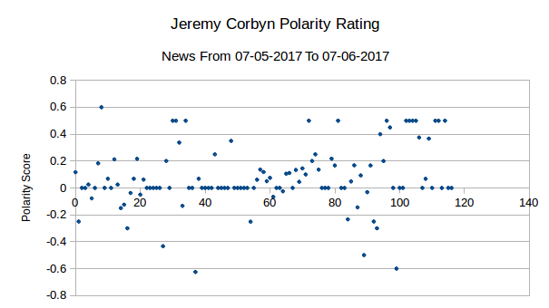
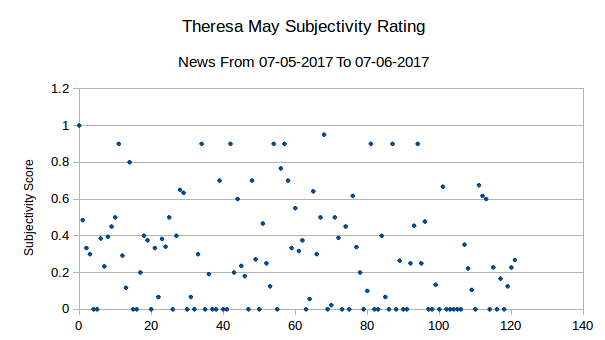
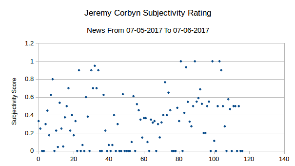

## UK News Bias

This is a quick and dirty article on trying to detect news bias in news media
on the 2017 UK elections using sentiment analysis (TextBlob 0.12.0) and it's
default training package. The reason for this is that there have been various
claims of bias that the main-stream news media have been biased in the
reporting up to the election [1] [2]. In the study concentrated on here [2],
they fail to analyse the opposite side, allowing them to draw any conclusions
they want using their Content Analysis.

### Data

The data was sourced by using the DuckDuckGo search engine because they have
their "do not track" policy, which I thought would make the searching much
better. I did originally look at trying to get news from RSS feeds, but it
seemed as if I would actually have to collect data for several months in order
for that to work. I used the following search terms, "Theresa May politics" and
"Jeremy Corbyn politics", get the results which were simply copied and pasted
into a `gvim`. I then proceeded to clean the data by just keeping the abstract
of the news article.

As you can see, we get a nice spread of news articles, although one down side
is that there really isn't much text to analyse. It's hoped that the opening
sentence/s are representative on average of the content of the article to
follow. All data used is stored in the `dat/` directory of this repository.

### Implementation

There were two, then there were one...

I apologise in advance to any hard core Python enthusiasts - I don't really
like Python, but it's the quickest language I could think of to hack this kind
of thing together. Hopefully you find the code still readable.

#### Dictionary Lookup

So this was meant to be a quick and dirty hack to get some results of of the
data, but didn't end up yielding any results. When it did work, it didn't
really flag up any really interesting results and hinted that sentiment
analysis is actually something that is tougher than I previously thought.

I left the code in anyway for completeness, maybe somebody can get it working
or something.

#### TextBlob Sentiment Analysis

I decided to use TextBlob for the sentiment analysis, as it really is a simple
to us implementation [3]. A lot of the others I was looking at required
training before I could get anything working and in reality, what I was looking
for was a "near-enough" solution.

### Running

Firstly, you must install TextBlob and it's packages:

    pip install -U textblob
    python -m textblob.download_corpora

Be sure to read more of their installation instructions if you get stuck [4].

You should now simply be able to run the bash script `run.sh` at the top of the
directory to produce these results - I wanted to make it as simple as possible
for other people to be able to replicate my experiment.

### Results

Below are the raw results - we will discuss what they mean in the conclusion.

#### Popularity Scoring for Theresa May

* **Average:** 0.115989668
* **Standard Deviations:** 0.214891004

#### Popularity Scoring for Jeremy Corbyn

* **Average:** 0.077666767
* **Standard Deviations:** 0.229633656

#### Subjectivity Scoring for Theresa May

* **Average:** 0.292715977
* **Standard Deviations:** 0.290934413

#### Subjectivity Scoring for Jeremy Corbyn

* **Average:** 0.33409501
* **Standard Deviations:** 0.297444943

### Conclusion

Firstly, the standard deviation shows the data is pretty well matched in terms
of distribution, a statement backed visually by the graphs themselves. It's
fair to say that there isn't the clearest distribution of data here, but
equally it is not the worst correlation possible.

The subjectivity rating in the article abstracts seem to be quite evenly
distributed, both with ratings approximately 0.3.

The polarity score on the other hand is quite, with May's rating edging out at
~0.12 and Corbyn lower at 0.08. We're splitting though and these are not
substantially different enough to be a cause for concern.

I would say that the claim made my LSE, that Corbyn has been unfairly
represented in the main-stream media is uninstantiated, at least from these
results seen here. A more detailed analysis could certainly be warranted, but
from at least the summary presented here, there shouldn't be a stark difference
across a random selection of media. It is likely, however, that individual
news-outlets will introduce their own bias, but this is the reason why their
readers buy their papers in the first place.

### References

[[1](http://www.independent.co.uk/news/uk/politics/jeremy-corbyn-media-bias-attacks-75-per-cent-three-quarters-fail-to-accurately-report-a7140681.html?cmpid=facebook-post)] The Independent

[[2](http://www.lse.ac.uk/media@lse/research/pdf/JeremyCorbyn/Cobyn-Report-FINAL.pdf)] London School of Economics and Political Science

[[3](https://textblob.readthedocs.io/en/latest/quickstart.html#quickstart)] TextBlob

[[4](https://textblob.readthedocs.io/en/latest/install.html)] TextBlob
